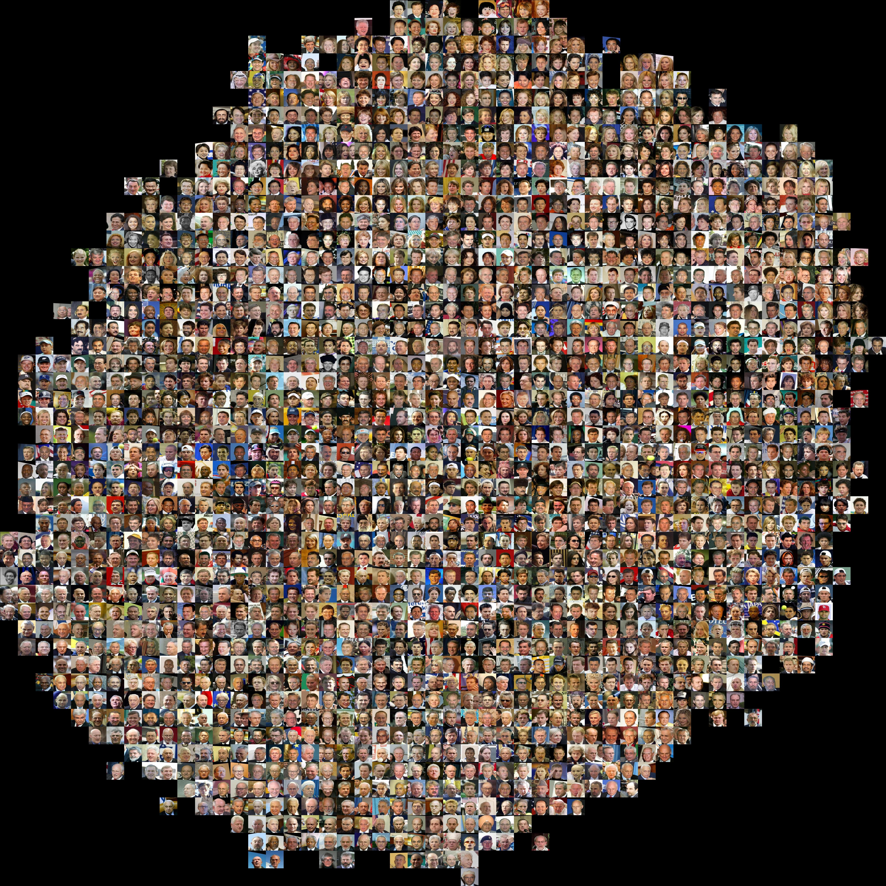

## MobileID: Face Model Compression by Distilling Knowledge from Neurons
[[Project]](http://personal.ie.cuhk.edu.hk/~lz013/projects/MobileID.html) [[Paper]](http://personal.ie.cuhk.edu.hk/~pluo/pdf/aaai16-face-model-compression.pdf)   

## Overview
`MobileID` is an extremely fast face recognition system by distilling knowledge from [DeepID2](http://www.ee.cuhk.edu.hk/~xgwang/papers/sunCWTnips14.pdf). Given a detected and aligned face image, this software outputs a low-dimentional *face representation* which faithfully preserves its identity information. More details can be found in our paper:
"Face Model Compression by Distilling Knowledge from Neurons"
[Ping Luo](http://personal.ie.cuhk.edu.hk/~pluo/), [Zhenyao Zhu](https://scholar.google.com/citations?user=r3k-4MYAAAAJ&hl=en), [Ziwei Liu](http://personal.ie.cuhk.edu.hk/~lz013/), [Xiaogang Wang](http://www.ee.cuhk.edu.hk/~xgwang/), [Xiaoou Tang](https://www.ie.cuhk.edu.hk/people/xotang.shtml) (The Chinese University of Hong Kong)
In AAAI Conference on Artificial Intelligence (AAAI) 2016, Oral Presentation



Further information please contact [Ziwei Liu](http://personal.ie.cuhk.edu.hk/~lz013/).

## Requirements
* [Caffe](https://github.com/BVLC/caffe)
* [t-SNE](https://lvdmaaten.github.io/tsne/)

## Getting started
* Install and compile the [Caffe](https://github.com/BVLC/caffe) and [t-SNE](https://lvdmaaten.github.io/tsne/) libraries.
* Download the pre-trained model [mobile_id.caffemodel](https://drive.google.com/file/d/0B7EVK8r0v71pNDUzcTRJOGxHbjg/view?usp=sharing):
``` bash
Place "mobile_id.caffemodel" into "./models/" 
```
* Download the pre-stored align&&cropped LFW dataset [lfw.zip](https://drive.google.com/file/d/0B7EVK8r0v71pNGdPdExaemRxNlk/view?usp=sharing):
``` bash
Place "lfw.zip" into "./data/gallery/" and unzip
```
* Run the feature extraction script:
``` bash
sh ./extract_features_gallery.sh
```
* Run the visualization script:
``` bash
matlab ./gen_tsne_gallery.m
```

## Performance
The `MobileID` system is trained on [CelebA Dataset](http://mmlab.ie.cuhk.edu.hk/projects/CelebA.html) and tested on [LFW Dataset](http://vis-www.cs.umass.edu/lfw/). When equipped with [Joint Bayesian](http://www.jiansun.org/papers/ECCV12_BayesianFace.pdf), it achieves excellent performance as well as fast speed, as shown below:

| Face verification accuracy on LFW     | Runtime on CPU              | Memory footprint during inference  |
|:-------------------------------------:|:---------------------------:|:----------------------------------:|
| 97.32% (mean classification accuracy) | 250FPS (frames per second)  | 2M (megabytes)                     |

## Dataset
[Large-scale CelebFaces Attributes (CelebA) Dataset](http://mmlab.ie.cuhk.edu.hk/projects/CelebA.html)

*Note that there are no identity overlapping between [CelebA Dataset](http://mmlab.ie.cuhk.edu.hk/projects/CelebA.html) and [LFW Dataset](http://vis-www.cs.umass.edu/lfw/).*

## Citation
```
@inproceedings{luo2016mobileid,
 author = {Ping Luo, Zhenyao Zhu, Ziwei Liu, Xiaogang Wang, and Xiaoou Tang},
 title = {Face Model Compression by Distilling Knowledge from Neurons},
 booktitle = {AAAI Conference on Artificial Intelligence (AAAI)},
 month = {February},
 year = {2016} 
}
```
